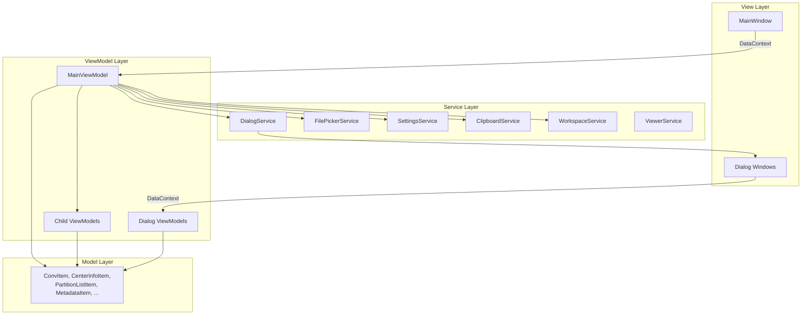
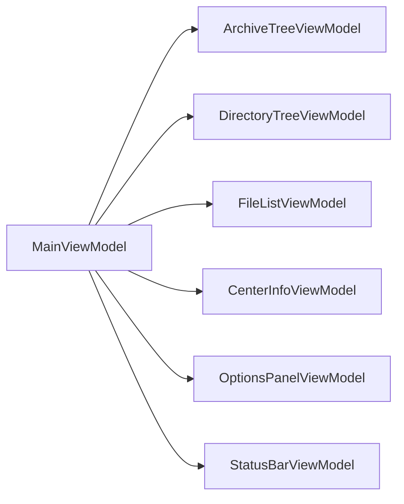
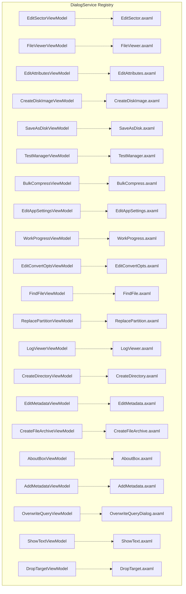
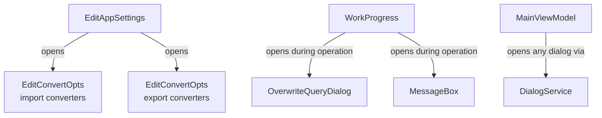
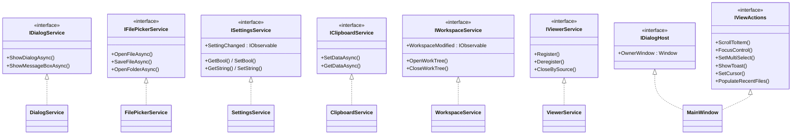
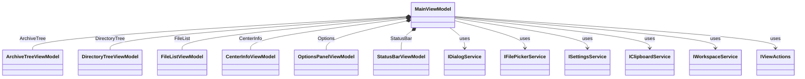

# MVVM Refactoring — Class & Type Reference

This document catalogs every new or converted class, interface, service, ViewModel,
model, enum, and supporting type across all iterations of the MVVM refactor.

**Audience:** A developer new to MVVM and ReactiveUI who needs a quick-reference
map of what gets created, when, and how the pieces relate.

---

## Table of Contents

1. [Architecture Overview Diagram](#1-architecture-overview-diagram)
2. [Phase 0 — Infrastructure (Iteration 0)](#2-phase-0--infrastructure-iteration-0)
3. [Phase 1A — Create MainViewModel (Iteration 1A)](#3-phase-1a--create-mainviewmodel-iteration-1a)
4. [Phase 1B — Wire DataContext (Iteration 1B)](#4-phase-1b--wire-datacontext-iteration-1b)
5. [Phase 2 — Commands → ReactiveCommand (Iteration 2)](#5-phase-2--commands--reactivecommand-iteration-2)
6. [Phase 3A — Service Interfaces & DI (Iteration 3A)](#6-phase-3a--service-interfaces--di-iteration-3a)
7. [Phase 3B — Dissolve MainController (Iteration 3B)](#7-phase-3b--dissolve-maincontroller-iteration-3b)
8. [Phase 4A — Complex Dialog ViewModels (Iteration 4A)](#8-phase-4a--complex-dialog-viewmodels-iteration-4a)
9. [Phase 4B — Remaining Dialog ViewModels (Iteration 4B)](#9-phase-4b--remaining-dialog-viewmodels-iteration-4b)
10. [Phase 5 — Child ViewModels (Iteration 5)](#10-phase-5--child-viewmodels-iteration-5)
11. [Phase 6 — Polish & Optional (Iteration 6)](#11-phase-6--polish--optional-iteration-6)
12. [View ↔ ViewModel Mappings](#12-view--viewmodel-mappings)
13. [Inheritance & Interface Diagrams](#13-inheritance--interface-diagrams)
14. [DI Registration Summary](#14-di-registration-summary)
15. [Summary Statistics](#15-summary-statistics)

---

## 1. Architecture Overview Diagram

---

## 2. Phase 0 — Infrastructure (Iteration 0)

**Goal:** Add ReactiveUI NuGet packages, wire `.UseReactiveUI()`, set up DI
container, and extract inner classes from `MainWindow` into standalone model files.

| Name | Kind | Folder | Replaces | Base/Interfaces | Responsibilities |
|------|------|--------|----------|-----------------|-----------------|
| `ConvItem` | Model | `Models/` | `MainWindow.ConvItem` | Plain class | Import/export converter item (tag + label) |
| `CenterInfoItem` | Model | `Models/` | `MainWindow.CenterInfoItem` | Plain class | Key/value pair for center info panel |
| `PartitionListItem` | Model | `Models/` | `MainWindow.PartitionListItem` | Plain class | Partition layout entry (block info, index, name, type) |
| `MetadataItem` | Model | `Models/` | `MainWindow.MetadataItem` | `INotifyPropertyChanged` | Metadata entry with key, value, syntax rules, can-edit flag |

---

## 3. Phase 1A — Create MainViewModel (Iteration 1A)

**Goal:** Create `MainViewModel` and move ~100 bindable properties out of
`MainWindow.axaml.cs` code-behind into it.

| Name | Kind | Folder | Replaces | Base/Interfaces | Responsibilities |
|------|------|--------|----------|-----------------|-----------------|
| `MainViewModel` | ViewModel | `ViewModels/` | New | `ReactiveObject` | Primary application ViewModel. Owns panel visibility, tree collections, file list, center info, toolbar state, recent files, converter selections, status text, and option toggles. Has temporary `SetController()` bridge removed in Phase 3B. |

---

## 4. Phase 1B — Wire DataContext (Iteration 1B)

**Goal:** Switch `MainWindow.DataContext` from `this` (the Window) to the new
`MainViewModel` instance, and update all AXAML bindings accordingly.

> No new types introduced. This phase modifies existing files only.

---

## 5. Phase 2 — Commands → ReactiveCommand (Iteration 2)

**Goal:** Convert all 51 `RelayCommand` instances on `MainWindow` to
`ReactiveCommand<Unit, Unit>` properties on `MainViewModel`.

> No new types introduced. Existing `RelayCommand` instances are replaced with
> `ReactiveCommand` instances. The `RelayCommand` class itself is retained until
> Phase 4B cleanup.

---

## 6. Phase 3A — Service Interfaces & DI (Iteration 3A)

**Goal:** Define service abstractions, implement them, and register them in the
DI container. This decouples ViewModels from Avalonia platform APIs.

### Interfaces

| Name | Kind | Folder | Responsibilities |
|------|------|--------|-----------------|
| `IDialogHost` | Interface | `Services/` | Provides owner `Window` reference for dialog positioning. Implemented by `MainWindow`. |
| `IDialogService` | Interface | `Services/` | Shows modal/modeless dialogs, message boxes, and confirmation prompts. Maps ViewModel types → View types. |
| `IFilePickerService` | Interface | `Services/` | File open, file save, and folder picker abstraction. |
| `ISettingsService` | Interface | `Services/` | Settings read/write with `SettingChanged` observable for reactive notification. |
| `IClipboardService` | Interface | `Services/` | Clipboard get/set for same-process and cross-process paste. Supports text and uri-list formats. |
| `IWorkspaceService` | Interface | `Services/` | WorkTree lifecycle, formatter access, recent files. (Implementation deferred to Phase 3B.) |
| `IViewerService` | Interface | `Services/` | Registry for active `FileViewerViewModel` instances, source-scoped cleanup. (Implementation deferred to Phase 6.) |

### Implementations

| Name | Kind | Folder | Implements | Responsibilities |
|------|------|--------|------------|-----------------|
| `DialogService` | Service | `Services/` | `IDialogService` | Manages ViewModel→View type mappings, creates dialog windows, shows via `ShowDialogAsync`. |
| `FilePickerService` | Service | `Services/` | `IFilePickerService` | Wraps Avalonia `StorageProvider`. Resolves start directories via `IDialogHost`. |
| `SettingsService` | Service | `Services/` | `ISettingsService` | Thin wrapper around existing `SettingsHolder` / `AppSettings.Global`. Loads/saves JSON. Fires `SettingChanged` observable. |
| `ClipboardService` | Service | `Services/` | `IClipboardService` | Manages pending clipboard data. Handles CP2 JSON + text/uri-list. Supports external file-manager paste. |

### Enums

| Name | Kind | Folder | Purpose |
|------|------|--------|---------|
| `MBButton` | Enum | `Services/` | Message box button options (OK, OKCancel, YesNo, YesNoCancel) |
| `MBIcon` | Enum | `Services/` | Message box icon options (None, Info, Warning, Error, Question) |
| `MBResult` | Enum | `Services/` | Message box result values (OK, Cancel, Yes, No) |
| `AutoOpenDepth` | Enum | `Models/` | Archive open depth limit (Shallow, SubVol, Max). Promoted from `MainController` nested enum. |

### Stubs

| Name | Kind | Folder | Purpose |
|------|------|--------|---------|
| `FileViewerViewModel` | ViewModel (stub) | `ViewModels/` | Minimal placeholder for Phase 4A. Inherits `ReactiveObject`, `IDisposable`. |

---

## 7. Phase 3B — Dissolve MainController (Iteration 3B)

**Goal:** Migrate all business logic from `MainController.cs` and
`MainController_Panels.cs` into `MainViewModel`, services, and `IViewActions`.
Delete both controller files when done.

| Name | Kind | Folder | Replaces | Base/Interfaces | Responsibilities |
|------|------|--------|----------|-----------------|-----------------|
| `WorkspaceService` | Service | `Services/` | `MainController` WorkTree lifecycle code | `IWorkspaceService` | Opens/closes WorkTree, maintains recent files, provides Formatter and AppHook. Fires `WorkspaceModified` observable after file operations. |
| `IViewActions` | Interface | `cp2_avalonia/` root | New abstraction | Interface | View-level operations that cannot live in a ViewModel: scroll, focus, multi-select, toast notification, cursor changes, recent-files menu population. Implemented by `MainWindow`. |
| `CenterPanelChange` | Enum | `Models/` | Promoted from `MainWindow` | Enum | Center panel toggle type (Files, Info, Toggle) |

---

## 8. Phase 4A — Complex Dialog ViewModels (Iteration 4A)

**Goal:** Convert the 7 most complex dialogs from code-behind to ViewModel pattern.

### Dialog ViewModels

| Name | Folder | Replaces Code-Behind | Key Dependencies | Responsibilities |
|------|--------|---------------------|------------------|-----------------|
| `EditSectorViewModel` | `ViewModels/` | `EditSector.axaml.cs` | `IClipboardService`, `IDialogService` | Hex grid navigation, read/write sectors/blocks, dirty tracking, clipboard copy, text-encoding mode |
| `FileViewerViewModel` | `ViewModels/` | `Tools/FileViewer.axaml.cs` | `ISettingsService`, `IFilePickerService`, `IClipboardService`, `IWorkspaceService`, `IViewerService` | Multi-format file display (hex/text/graphics), magnification, find, export, fork-tab selection, source-modified warning. Registers with `IViewerService`. |
| `EditAttributesViewModel` | `ViewModels/` | `EditAttributes.axaml.cs` | `IDialogService` | File/directory name, type, creator, timestamps, access flags, comment, validation, MacZip handling |
| `CreateDiskImageViewModel` | `ViewModels/` | `CreateDiskImage.axaml.cs` | `ISettingsService` | Disk size, filesystem, file format, volume name/number, boot tracks, validation |
| `SaveAsDiskViewModel` | `ViewModels/` | `SaveAsDisk.axaml.cs` | — | Format selection, chunk-access info, estimated size, format capabilities |
| `TestManagerViewModel` | `ViewModels/` | `LibTest/TestManager.axaml.cs` | — | Test runner UI, progress with colored output, failure browser. Retains `BackgroundWorker`. |
| `BulkCompressViewModel` | `ViewModels/` | `LibTest/BulkCompress.axaml.cs` | — | Compression benchmark, format selection, progress, log display. Retains `BackgroundWorker`. |

### Inner / Nested Types (moved with their parent ViewModel)

| Name | Kind | Parent ViewModel | Replaces |
|------|------|-----------------|----------|
| `SectorRow` | Inner class | `EditSectorViewModel` | `EditSector.SectorRow` |
| `SectorEditMode` | Enum | `EditSectorViewModel` | `EditSector.SectorEditMode` |
| `TxtConvMode` | Enum | `EditSectorViewModel` | `EditSector.TxtConvMode` |
| `BlockOrderItem` | Inner class | `EditSectorViewModel` | `EditSector.BlockOrderItem` |
| `SectorOrderItem` | Inner class | `EditSectorViewModel` | `EditSector.SectorOrderItem` |
| `EnableWriteFunc` | Delegate | `EditSectorViewModel` | `EditSector.EnableWriteFunc` |
| `ConverterComboItem` | Inner class | `FileViewerViewModel` | `FileViewer.ConverterComboItem` |
| `DisplayItemType` | Enum | `FileViewerViewModel` | `FileViewer.DisplayItemType` |
| `Tab` | Enum | `FileViewerViewModel` | `FileViewer.Tab` |
| `ProTypeListItem` | Inner class | `EditAttributesViewModel` | `EditAttributes.ProTypeListItem` |

### Shared Enums (extracted to standalone files)

| Name | Kind | Folder | Replaces |
|------|------|--------|----------|
| `DiskSizeValue` | Enum | `Models/DiskImageTypes.cs` | `CreateDiskImage.DiskSizeValue` |
| `FileTypeValue` | Enum | `Models/DiskImageTypes.cs` | `CreateDiskImage.FileTypeValue` |

---

## 9. Phase 4B — Remaining Dialog ViewModels (Iteration 4B)

**Goal:** Convert 6 medium-complexity and 8 simple dialogs, then retire the
legacy `RelayCommand` class.

### Medium-Complexity Dialog ViewModels

| Name | Folder | Replaces Code-Behind | Key Dependencies | Responsibilities |
|------|--------|---------------------|------------------|-----------------|
| `EditAppSettingsViewModel` | `ViewModels/` | `EditAppSettings.axaml.cs` | `ISettingsService`, `IDialogService` | Theme mode, audio algorithm, feature toggles, nested EditConvertOpts sub-dialogs |
| `WorkProgressViewModel` | `ViewModels/` | `Common/WorkProgress.axaml.cs` | `IDialogService` | Cancellable async progress tracking, overwrite-query nesting, message-box query handling. Retains `BackgroundWorker`. |
| `EditConvertOptsViewModel` | `ViewModels/` | `EditConvertOpts.axaml.cs` | `ISettingsService` | Converter option configuration, dynamic control mapping, settings merge/commit |
| `FindFileViewModel` | `ViewModels/` | `FindFile.axaml.cs` | — | File search UI (modeless), pattern matching, search options. Exposes `FindRequested` observable. Implements `IDisposable`. |
| `ReplacePartitionViewModel` | `ViewModels/` | `ReplacePartition.axaml.cs` | `IFilePickerService` | Partition compatibility validation, source/dest info, copy orchestration |
| `LogViewerViewModel` | `ViewModels/` | `Tools/LogViewer.axaml.cs` | — | Debug log display (modeless), auto-scroll, save, copy. Implements `IDisposable`. |

### Simple Dialog ViewModels

| Name | Folder | Replaces Code-Behind | Responsibilities |
|------|--------|---------------------|-----------------|
| `CreateDirectoryViewModel` | `ViewModels/` | `CreateDirectory.axaml.cs` | Directory name input and validation |
| `EditMetadataViewModel` | `ViewModels/` | `EditMetadata.axaml.cs` | Metadata key/value editing, delete flag, syntax validation |
| `CreateFileArchiveViewModel` | `ViewModels/` | `CreateFileArchive.axaml.cs` | Archive format selection (Binary2, NuFX, Zip) |
| `AboutBoxViewModel` | `ViewModels/` | `AboutBox.axaml.cs` | Version strings, legal text, runtime info |
| `AddMetadataViewModel` | `ViewModels/` | `AddMetadata.axaml.cs` | New metadata entry creation with validation |
| `OverwriteQueryViewModel` | `ViewModels/` | `Actions/OverwriteQueryDialog.axaml.cs` | Overwrite confirmation with "apply to all" option |
| `ShowTextViewModel` | `ViewModels/` | `Tools/ShowText.axaml.cs` | Simple text display (system info, test failures) |
| `DropTargetViewModel` | `ViewModels/` | `Tools/DropTarget.axaml.cs` | Clipboard/drag-drop debug inspector (modeless). Implements `IDisposable`. |

### Inner / Nested Types

| Name | Kind | Parent ViewModel | Replaces |
|------|------|-----------------|----------|
| `ConverterListItem` | Inner class | `EditConvertOptsViewModel` | `EditConvertOpts.ConverterListItem` |
| `FindFileReq` | Model class | `FindFileViewModel` or `Models/` | Find request parameters (pattern, direction, case) |
| `LogEntry` | Model class | `LogViewerViewModel` or `Models/` | Single log entry (timestamp, severity, message) |
| `MessageBoxViewModel` | ViewModel | `ViewModels/` | Generic configurable message box (new) |

### Retired

| Name | Action | Notes |
|------|--------|-------|
| `RelayCommand` | **Deleted** | All instances replaced by `ReactiveCommand` in Phase 2. File `Common/RelayCommand.cs` removed. |

---

## 10. Phase 5 — Child ViewModels (Iteration 5)

**Goal:** Extract groups of related properties and methods from `MainViewModel`
into focused child ViewModels, reducing `MainViewModel` to a coordinator.

| Name | Folder | Base/Interfaces | Responsibilities |
|------|--------|-----------------|-----------------|
| `ArchiveTreeViewModel` | `ViewModels/` | `ReactiveObject`, `IDisposable` | Archive tree root collection, selection tracking, `IsSelected` bidirectional sync, cached selection for cross-panel navigation |
| `DirectoryTreeViewModel` | `ViewModels/` | `ReactiveObject`, `IDisposable` | Directory tree root collection, selection tracking, `IsSelected` bidirectional sync, population helpers |
| `FileListViewModel` | `ViewModels/` | `ReactiveObject`, `IDisposable` | File list collection, sorting (column, direction, reset), column widths, multi-select, entry counts, population methods |
| `CenterInfoViewModel` | `ViewModels/` | `ReactiveObject` | Center info text/list, partition layout, metadata items, notes list, visibility toggles, double-click and add-entry handlers |
| `OptionsPanelViewModel` | `ViewModels/` | `ReactiveObject`, `IDisposable` | ~20 boolean option properties, enum mode selectors (DDCP, ExtPreserve), converter list and selection, settings sync |
| `StatusBarViewModel` | `ViewModels/` | `ReactiveObject` | Center and right status text, entry-count formatting |

### Composition relationship

All child VMs are **long-lived**, created once in `MainViewModel`'s constructor,
and disposed when `MainViewModel` is disposed. Cross-panel coordination logic
(e.g., archive selection changes triggering directory tree population) stays
on `MainViewModel`.

---

## 11. Phase 6 — Polish & Optional (Iteration 6)

**Goal:** Final cleanup, unit test infrastructure, performance audit, and
optional multi-viewer preparation.

| Name | Kind | Folder | Implements | Responsibilities |
|------|------|--------|------------|-----------------|
| `ViewerService` | Service | `Services/` | `IViewerService` | Registry for active `FileViewerViewModel` instances, source-scoped cleanup, thread-safe collection management |

> Phase 6 primarily involves cleanup and testing. No other new types are
> mandated beyond `ViewerService`.

---

## 12. View ↔ ViewModel Mappings

Every View (an `.axaml` window or user control) gets its data and behavior from
exactly one ViewModel, set as the View's `DataContext`. The `DialogService`
maintains a registry of these pairings so it can create the right window for
any given ViewModel type.

### Main Window

| View (AXAML) | ViewModel | Modality | Notes |
|---|---|---|---|
| `MainWindow.axaml` | `MainViewModel` | — | Top-level application window. Also implements `IDialogHost` and `IViewActions`. |

`MainWindow` hosts several panels whose bindings reach into child ViewModels
owned by `MainViewModel`:

| Panel Region | Child ViewModel | Binding Prefix |
|---|---|---|
| Archive tree (left) | `ArchiveTreeViewModel` | `{Binding ArchiveTree.…}` |
| Directory tree (left) | `DirectoryTreeViewModel` | `{Binding DirectoryTree.…}` |
| File list (center) | `FileListViewModel` | `{Binding FileList.…}` |
| Info / metadata (center) | `CenterInfoViewModel` | `{Binding CenterInfo.…}` |
| Options sidebar (right) | `OptionsPanelViewModel` | `{Binding Options.…}` |
| Status bar (bottom) | `StatusBarViewModel` | `{Binding StatusBar.…}` |

### Dialog View ↔ ViewModel Map

Each dialog window uses a single ViewModel as its `DataContext`. The
`DialogService` maps ViewModel types to View types at startup so that showing
a dialog only requires constructing the ViewModel — the service creates the
correct window automatically.

| View (AXAML) | ViewModel | Modality | Phase |
|---|---|---|---|
| `EditSector.axaml` | `EditSectorViewModel` | Modal | 4A |
| `Tools/FileViewer.axaml` | `FileViewerViewModel` | Modal (multi-instance) | 4A |
| `EditAttributes.axaml` | `EditAttributesViewModel` | Modal | 4A |
| `CreateDiskImage.axaml` | `CreateDiskImageViewModel` | Modal | 4A |
| `SaveAsDisk.axaml` | `SaveAsDiskViewModel` | Modal | 4A |
| `LibTest/TestManager.axaml` | `TestManagerViewModel` | Modal | 4A |
| `LibTest/BulkCompress.axaml` | `BulkCompressViewModel` | Modal | 4A |
| `EditAppSettings.axaml` | `EditAppSettingsViewModel` | Modal | 4B |
| `Common/WorkProgress.axaml` | `WorkProgressViewModel` | Modal | 4B |
| `EditConvertOpts.axaml` | `EditConvertOptsViewModel` | Modal | 4B |
| `FindFile.axaml` | `FindFileViewModel` | **Modeless** | 4B |
| `ReplacePartition.axaml` | `ReplacePartitionViewModel` | Modal | 4B |
| `Tools/LogViewer.axaml` | `LogViewerViewModel` | **Modeless** | 4B |
| `CreateDirectory.axaml` | `CreateDirectoryViewModel` | Modal | 4B |
| `EditMetadata.axaml` | `EditMetadataViewModel` | Modal | 4B |
| `CreateFileArchive.axaml` | `CreateFileArchiveViewModel` | Modal | 4B |
| `AboutBox.axaml` | `AboutBoxViewModel` | Modal | 4B |
| `AddMetadata.axaml` | `AddMetadataViewModel` | Modal | 4B |
| `Actions/OverwriteQueryDialog.axaml` | `OverwriteQueryViewModel` | Modal | 4B |
| `Tools/ShowText.axaml` | `ShowTextViewModel` | Modal | 4B |
| `Tools/DropTarget.axaml` | `DropTargetViewModel` | **Modeless** | 4B |
| *(generated at runtime)* | `MessageBoxViewModel` | Modal | 4B |

### Diagram — DialogService ViewModel → View Registry

### Modeless Dialog Lifecycle

Three dialogs are **modeless** — they stay open alongside the main window and
communicate back via observables or callbacks rather than a dialog result:

| Modeless View | ViewModel | Communication Pattern |
|---|---|---|
| `FindFile.axaml` | `FindFileViewModel` | Exposes `FindRequested` observable; `MainViewModel` subscribes |
| `Tools/LogViewer.axaml` | `LogViewerViewModel` | Reads debug log; self-contained display |
| `Tools/DropTarget.axaml` | `DropTargetViewModel` | Reads clipboard/drag data; self-contained display |

### Nested Dialog Relationships

Some dialogs spawn child dialogs during their operation:

---

## 13. Inheritance & Interface Diagrams

### ViewModel Hierarchy

All ViewModels inherit from ReactiveUI's `ReactiveObject`, which provides
`INotifyPropertyChanged` and `INotifyPropertyChanging` automatically.

```mermaid
classDiagram
    class ReactiveObject {
        <<ReactiveUI base>>
        +RaiseAndSetIfChanged()
        +WhenAnyValue()
    }

    ReactiveObject <|-- MainViewModel
    ReactiveObject <|-- ArchiveTreeViewModel
    ReactiveObject <|-- DirectoryTreeViewModel
    ReactiveObject <|-- FileListViewModel
    ReactiveObject <|-- CenterInfoViewModel
    ReactiveObject <|-- OptionsPanelViewModel
    ReactiveObject <|-- StatusBarViewModel
    ReactiveObject <|-- EditSectorViewModel
    ReactiveObject <|-- FileViewerViewModel
    ReactiveObject <|-- EditAttributesViewModel
    ReactiveObject <|-- CreateDiskImageViewModel
    ReactiveObject <|-- SaveAsDiskViewModel
    ReactiveObject <|-- EditAppSettingsViewModel
    ReactiveObject <|-- EditConvertOptsViewModel
    ReactiveObject <|-- WorkProgressViewModel
    ReactiveObject <|-- FindFileViewModel
    ReactiveObject <|-- LogViewerViewModel
    ReactiveObject <|-- DropTargetViewModel
    ReactiveObject <|-- ReplacePartitionViewModel
    ReactiveObject <|-- CreateDirectoryViewModel
    ReactiveObject <|-- EditMetadataViewModel
    ReactiveObject <|-- CreateFileArchiveViewModel
    ReactiveObject <|-- AboutBoxViewModel
    ReactiveObject <|-- AddMetadataViewModel
    ReactiveObject <|-- OverwriteQueryViewModel
    ReactiveObject <|-- ShowTextViewModel
    ReactiveObject <|-- TestManagerViewModel
    ReactiveObject <|-- BulkCompressViewModel
    ReactiveObject <|-- MessageBoxViewModel

    class IDisposable {
        <<interface>>
        +Dispose()
    }

    IDisposable <|.. FileViewerViewModel
    IDisposable <|.. FindFileViewModel
    IDisposable <|.. LogViewerViewModel
    IDisposable <|.. DropTargetViewModel
    IDisposable <|.. ArchiveTreeViewModel
    IDisposable <|.. DirectoryTreeViewModel
    IDisposable <|.. FileListViewModel
    IDisposable <|.. OptionsPanelViewModel
```

### Service Interface → Implementation Map

### MainViewModel Composition

---

## 14. DI Registration Summary

| Interface | Implementation | Lifetime | Iteration | Injected Into |
|-----------|---------------|----------|-----------|---------------|
| `ISettingsService` | `SettingsService` | **Singleton** | 3A | `MainViewModel`, `OptionsPanelViewModel`, `EditAppSettingsViewModel`, dialog VMs |
| `IClipboardService` | `ClipboardService` | **Singleton** | 3A | `MainViewModel`, `FileViewerViewModel`, `EditSectorViewModel` |
| `IWorkspaceService` | `WorkspaceService` | **Singleton** | 3B | `MainViewModel`, `FileViewerViewModel` |
| `IViewerService` | `ViewerService` | **Singleton** | 6 | `FileViewerViewModel` (registers self), `MainViewModel` (shutdown cleanup) |
| `IDialogService` | `DialogService` | **Manual** | 3A | `MainViewModel` — constructed per window, not container-registered |
| `IFilePickerService` | `FilePickerService` | **Manual** | 3A | `MainViewModel` — constructed per window, not container-registered |
| `IDialogHost` | `MainWindow` | **Manual** | 3A | `DialogService`, `FilePickerService` — passed at construction |
| `IViewActions` | `MainWindow` | **Manual** | 3B | `MainViewModel` — passed at construction |

> **Manual** means the instance is created explicitly (not resolved from the DI
> container) because it depends on the specific `Window` instance.

---

## 15. Summary Statistics

| Category | Count |
|----------|-------|
| **ViewModels (total)** | 29 |
| — Main ViewModel | 1 |
| — Child ViewModels (Phase 5) | 6 |
| — Complex dialog ViewModels (Phase 4A) | 7 |
| — Medium dialog ViewModels (Phase 4B) | 6 |
| — Simple dialog ViewModels (Phase 4B) | 8 |
| — Utility ViewModel (MessageBox) | 1 |
| **Service interfaces** | 7 |
| **Service implementations** | 6 |
| **Model / data classes** | 4 (Phase 0) + ~10 inner classes |
| **Enums** | 11 |
| **View-side interfaces** | 2 (`IDialogHost`, `IViewActions`) |
| **Retired classes** | 1 (`RelayCommand`) |

### Iteration-by-iteration new type count

| Iteration | New Types | Description |
|-----------|-----------|-------------|
| 0 | 4 | Model classes extracted from MainWindow |
| 1A | 1 | MainViewModel |
| 1B | 0 | Wiring only |
| 2 | 0 | Command conversion only |
| 3A | 12 | 7 interfaces, 4 implementations, 1 stub ViewModel |
| 3B | 3 | WorkspaceService, IViewActions, CenterPanelChange enum |
| 4A | 18 | 7 dialog VMs + ~11 inner types and shared enums |
| 4B | 17 | 14 dialog VMs + ~3 inner types |
| 5 | 6 | 6 child ViewModels |
| 6 | 1 | ViewerService |
